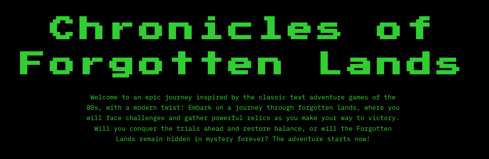
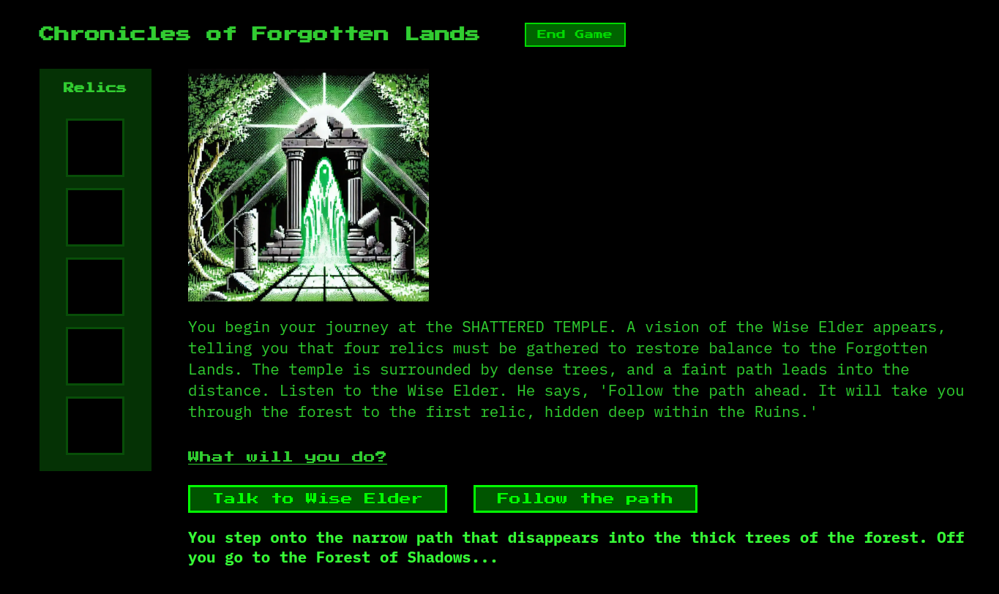
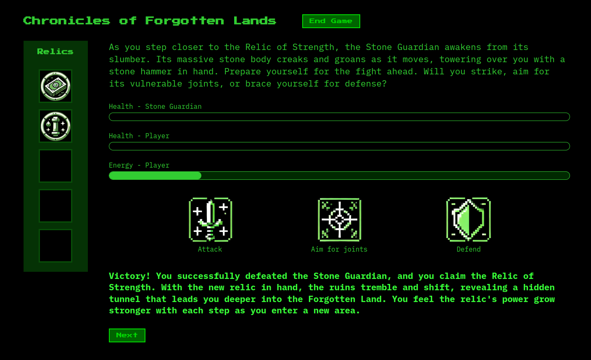
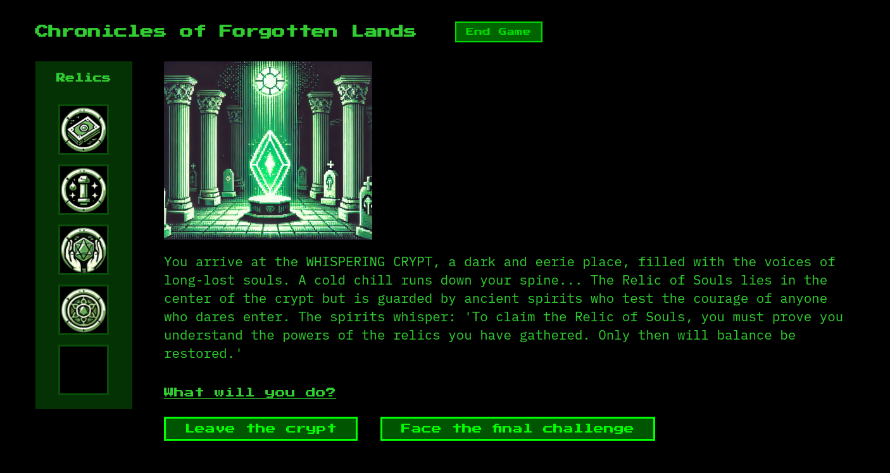

# Chronicles of Forgotten Lands - A Browser-Based Text Adventure Game

**Chronicles of Forgotten Lands** is a modern take on classic text-based adventure games, blending storytelling, puzzle-solving, and dynamic gameplay. In the Forgotten Lands you'll face riddles, combat and puzzle challenges, while collecting relics to restore balance to a long-lost world.

**[Play the Game Now!](https://diecatiamonteiro.github.io/text-adventure-game-browser/)**



## Table of Contents

- [Introduction](#introduction)
- [Features](#features)
- [How to Play](#how-to-play)
- [Project Structure](#project-structure)
- [Tech Stack](#tech-stack)
- [Preview](#preview)


## Introduction

**Chronicles of Forgotten Lands** is a text adventure game inspired by the classic text adventures of the 80s, now enhanced with modern web technologies like **HTML**, **CSS**, and **JavaScript**. It offers a narrative-driven experience where players make choices, solve challenges, and collect relics.

This game is part of my **personal learning journey**, marking a significant step forward from my earlier terminal-based text adventure game (which you can also find in my repositories). It highlights my growing skills in vanilla JavaScript and web development.

What I love most about this game is its **deliberately slow pace**. In a world that constantly demands fast interactions and quick rewards, this game is an invitation to slow down, read, reflect, and enjoy the journey—just like the classic text adventures of old. 

A quick note: the game is designed specifically for **desktop play only**, offering an experience best enjoyed on larger screens. For now, mobile support is not provided.


## Features

- **Engaging Storyline**: Embark on an journey through forgotten lands.
- **Dynamic Choices**: Use buttons to make choices in the lost world, or type your guesses in the riddle challenge.
- **Challenges**: Includes a variety of challenges—riddles, combat, drag-and-drop puzzles, and alignment games.
- **Relic Collection**: Collect unique relics and present them to restore balance to the lands.   
- **Flexible Content Management**: All game content is stored in a .json file, allowing easy updates or additions to the game’s scenes, challenges, and feedback.
- **Dynamic Content Loading**: The game dynamically fetches content from this .json file.


## How to play

1. **Play the game now [here](https://diecatiamonteiro.github.io/text-adventure-game-browser/)**.


2. **Clone the repository and play it on your machine**:

   ```bash
   git clone https://github.com/yourusername/chronicles-of-forgotten-lands.git
   ```


## Project Structure

```bash
chronicles-of-forgotten-lands/
├── assets/
│   └── align-game/
│   └── combat-icons/
│   └── puzzle/
│   └── relics/
│   └── scenes/
│   └── screenshots/
├── css/
│   └── style.css 
├── data/
│   └── data.json
├── js/
│   ├── challenges.js
│   ├── controls.js
│   ├── inventory.js
│   ├── main.js
│   ├── scenes.js
├── .gitignore/
├── index.html/ 
```

## Tech Stack

- **HTML5**: Structure of the game.
- **CSS3**: Styling and transitions for smooth animations.
- **JavaScript (ES6)**: Game logic, challenge handling, and dynamic scene transitions.
- **JSON**: Data storage for scenes, challenges, and game content.
- **GitHub**: Hosting and serving the `data.json` file, which is dynamically fetched to provide the game content.
- **AI**: Generating game images and enhancing game logic.

## Preview

Just enough to offer you a glimpse, but not so much that it takes away the excitement of playing because you feel like you’ve seen it all. :)

### Starting Scene



### Combat Challenge



### Relic Inventory Nearly Complete




<br>

# Thanks for reading! Enjoy your adventure in the Forgotten Lands!


